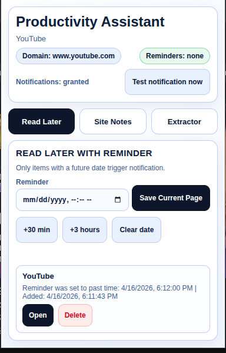
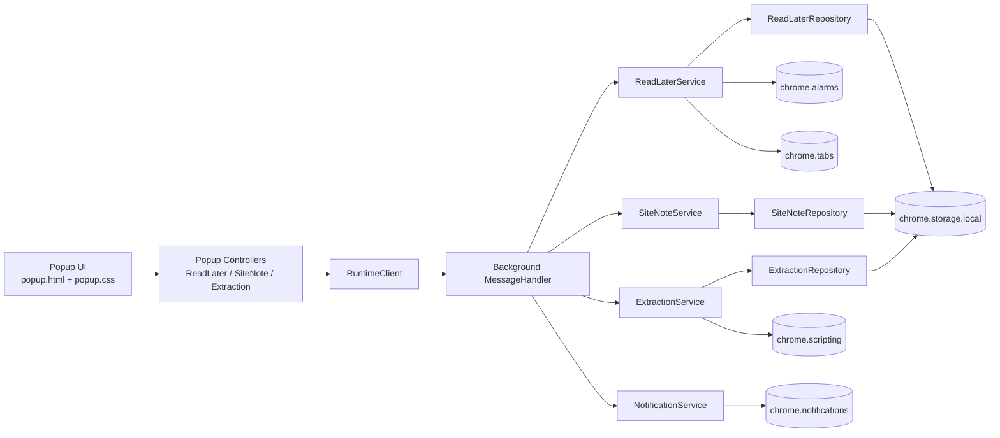

# Productivity Assistant (MV3 Browser Extension)

Productivity Assistant is a Manifest V3 browser extension built with TypeScript.
It helps you save pages to read later, store notes by domain, and extract page content into reusable Markdown/JSON snapshots.



## What this project does

The extension combines three workflows in a single popup:

- Read Later with optional reminders (`chrome.alarms` + `chrome.notifications`)
- Site Notes (one note per domain, persisted in `chrome.storage.local`)
- Page Extractor (headings, links, excerpt, plus generated Markdown and JSON)

## Core features

- Save current tab instantly to a read-later list
- Schedule reminder notifications for saved items
- Open or delete saved items from the popup
- Save and load domain-specific notes automatically
- Extract and store page snapshots from the active tab
- Copy extracted output as Markdown or JSON
- Trigger a test notification directly from the popup

## Architecture

This project uses a layered architecture with clear responsibilities and dependency boundaries:

- `shared` layer: cross-module contracts and message types
- `background` layer: application logic, use-cases, repositories, Chrome adapters
- `popup` layer: UI orchestration, feature controllers, runtime client, DOM abstraction

### High-level architecture diagram



### Project structure

```text
src/
  shared/
    contracts/
      messages.ts
  background/
    application/
      BackgroundApp.ts
      MessageHandler.ts
    domain/
      constants.ts
      gateways.ts
    infrastructure/
      Chrome*Gateway.ts
    repositories/
      *Repository.ts
    services/
      *Service.ts
    index.ts
  popup/
    application/
      PopupApp.ts
      *Controller.ts
    domain/
      PopupState.ts
    infrastructure/
      RuntimeClient.ts
      ChromePopupEnvironment.ts
    ui/
      DomRefs.ts
      TabNavigator.ts
      TextView.ts
    utils/
      date.ts
      url.ts
    index.ts
```

## Requirements

- Node.js 14+
- npm 6+ (indirectly used by scripts)
- Yarn 1.x recommended (`1.22.x`)
- Chromium-based browser for loading unpacked extensions

## Setup

Install dependencies:

```bash
yarn
```

Build extension:

```bash
yarn run build:linux
# or
yarn run build:windows
```

## Development workflow

This project currently uses a compile-and-reload loop.

1. Start by building once:

```bash
yarn run build:linux
```

2. Load `dist` as unpacked extension in your browser.
3. Edit code under `src/`.
4. Rebuild:

```bash
yarn run build:linux
```

5. Reload extension from extension manager page.

Optional TypeScript watch (transpile only):

```bash
npx tsc --watch
```

Note: asset copy (`popup.html`, `popup.css`, `manifest.json`, etc.) is not watched automatically, so you still need a build/copy step before reloading.

## How to load in browsers

### Google Chrome

1. Open `chrome://extensions`
2. Enable `Developer mode`
3. Click `Load unpacked`
4. Select the `dist` folder

### Microsoft Edge

1. Open `edge://extensions`
2. Enable `Developer mode`
3. Click `Load unpacked`
4. Select the `dist` folder

### Brave

1. Open `brave://extensions`
2. Enable `Developer mode`
3. Click `Load unpacked`
4. Select the `dist` folder

### Opera (Chromium-based)

1. Open extension manager page
2. Enable developer mode
3. Choose load unpacked extension
4. Select the `dist` folder

## How to use

1. Open any regular `http/https` page.
2. Click the extension icon.
3. Use the tabs inside popup:

- `Read Later`
- Save current page with optional reminder timestamp
- Open or delete saved entries
- `Site Notes`
- Write and save note for current domain
- Reload popup to verify note persistence
- `Extractor`
- Extract active page content
- Copy latest extraction as Markdown or JSON

## Notification behavior

- Reminders are scheduled with `chrome.alarms`
- Reminder notification appears via `chrome.notifications`
- Notification actions:
- `Open now`
- `Snooze 30 min`
- A reminder must be at least 1 minute in the future

## Available scripts

```bash
yarn run clean
yarn run compile
yarn run build:linux
yarn run build:windows
```

## Permissions used

- `activeTab`: access current active tab
- `tabs`: open tabs from saved reminders
- `scripting`: extract content from page context
- `storage`: persist read-later items, notes, extractions
- `alarms`: schedule reminders
- `notifications`: show reminder/test notifications

## Troubleshooting

- No notification received
- Ensure reminder time is at least 1 minute in the future
- Verify browser/system notification permissions
- Use `Test notification now` in popup
- Popup looks outdated
- Rebuild and reload extension from extensions page
- Extraction fails
- Run on regular `http/https` pages (not browser internal pages)
